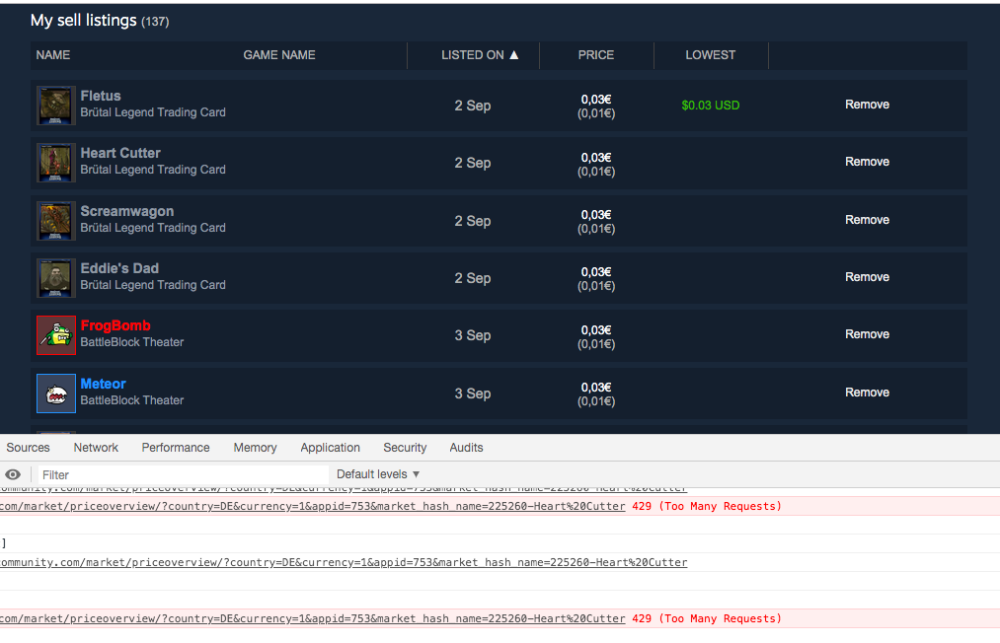

Fork to fix the 429 Too Many Requests on having a lot of sell listings.

The fix is super stupid and it is still a bit tedious: hit a lowercase `L` and it calls the `add_lowest_market_price()` function. There are probably better solutions to this, but this is what works for me ;)

Also open your browser's console to see if more 429s are reported, in that case, just wait about 20 seconds and hit lowercase `L` again. It also works a lot better when the `Per Page` setting is left at `10`.

This is a screenshot of the issue where the `Lowest` price is not populated anymore:

